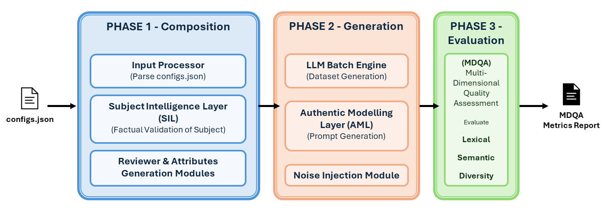

# CERA: Context-Engineered Reviews Architecture

<p align="center">
  
</p>

<p align="center">
  <b>A training-free framework for generating realistic, controllable synthetic review datasets for Aspect-Based Sentiment Analysis (ABSA).</b>
</p>

<p align="center">
  
  
  
</p>

---

> **Note:** This repository is currently under active development as part of an MSc thesis at the University of Windsor. Code will be released upon completion.

---

## Quick Start (Docker)

### Prerequisites
- Docker and Docker Compose
- Node.js (for Convex deployment)

### First-Time Setup

1. **Clone and create `.env`**
   ```bash
   git clone https://github.com/thangk/cera.git
   cd cera
   cp .env.example .env
   ```

2. **Start Convex backend**
   ```bash
   docker-compose up convex -d
   ```

3. **Generate admin key** (wait ~10 seconds for Convex to start)
   ```bash
   docker exec convex ./generate_admin_key.sh
   ```
   Copy the output (starts with `convex_...`)

4. **Add key to `.env`**
   ```
   CONVEX_ADMIN_KEY=convex_your_key_here
   ```

5. **Deploy Convex schema**
   ```bash
   cd gui
   npm install
   CONVEX_SELF_HOSTED_URL="http://localhost:3210" \
   CONVEX_SELF_HOSTED_ADMIN_KEY="$CONVEX_ADMIN_KEY" \
   npx convex dev --once
   cd ..
   ```

6. **Start all services**
   ```bash
   docker-compose up --build
   ```

### Access Points
| Service | URL |
|---------|-----|
| Web GUI | http://localhost:3001 |
| Python API | http://localhost:8000 |
| Convex Dashboard | http://localhost:6791 |
| PocketBase Admin | http://localhost:8090 |

### Optional: Add OpenRouter API Key
For real LLM generation (instead of placeholder mode), add your [OpenRouter API key](https://openrouter.ai/keys) to `.env`:
```
OPENROUTER_API_KEY=sk-or-v1-your-key-here
```

### Optional: GPU Acceleration (MDQA Metrics)

GPU acceleration significantly speeds up semantic metrics (BERTScore, MoverScore) during evaluation.

**Prerequisites:**
- NVIDIA GPU with CUDA support
- [NVIDIA Container Toolkit](https://docs.nvidia.com/datacenter/cloud-native/container-toolkit/install-guide.html) installed

**1. Verify GPU access in Docker:**
```bash
docker run --rm --gpus all nvidia/cuda:12.1.1-runtime-ubuntu22.04 nvidia-smi
```

If this fails, install NVIDIA Container Toolkit:
```bash
# Ubuntu/Debian (including WSL2)
distribution=$(. /etc/os-release;echo $ID$VERSION_ID)
curl -s -L https://nvidia.github.io/libnvidia-container/gpgkey | sudo apt-key add -
curl -s -L https://nvidia.github.io/libnvidia-container/$distribution/libnvidia-container.list | sudo tee /etc/apt/sources.list.d/nvidia-container-toolkit.list
sudo apt-get update && sudo apt-get install -y nvidia-container-toolkit
sudo systemctl restart docker
```

**2. Rebuild the CLI container with GPU support:**
```bash
docker-compose build cli
docker-compose up -d
```

**3. Verify GPU is detected:**
```bash
docker exec cli python -c "import torch; print(f'CUDA: {torch.cuda.is_available()}, Device: {torch.cuda.get_device_name(0) if torch.cuda.is_available() else \"N/A\"}')"
```

> **Note:** The GPU-enabled image is larger (~5GB vs ~1GB). To use CPU-only, comment out the `deploy` section in `docker-compose.yml` and change the base image in `cli/Dockerfile` to `python:3.11-slim`.

---

## Overview

CERA addresses critical challenges in ABSA research:

- **Data scarcity** - Benchmark datasets like SemEval contain only ~3K sentences
- **Class imbalance** - Real reviews skew ~65% positive, hurting minority class performance
- **Domain sparsity** - Niche domains lack sufficient annotated data

Unlike existing approaches that require model fine-tuning, CERA generates high-quality synthetic ABSA data using only **context engineering** and **multi-agent verification** — no GPU infrastructure, fine-tuning, or pre-existing embeddings required.

---

## Key Features

**Composition Phase:**

| Component | Description |
|-----------|-------------|
| **Subject Intelligence Layer (SIL)** | Agentic web search for factual grounding — reduces hallucination via current product intelligence |
| **Multi-Agent Verification (MAV)** | Cross-provider consensus (2/3 majority voting, $\tau$=0.85) for fact verification |
| **Reviewer Generation Module (RGM)** | Demographic-grounded persona diversity across 7 dimensions — personas, writing patterns, structure variants |
| **Attributes Composition Module (ACM)** | Configurable polarity distribution, noise injection, length/temperature bounds |

**Generation Phase:**

| Component | Description |
|-----------|-------------|
| **Authenticity Modeling Layer (AML)** | Combines all composition outputs into per-review blueprints under zero creative latitude |
| **Diversity Enforcement Module (DEM)** | Four submodules enforcing corpus diversity without additional LLM calls: |
| &nbsp;&nbsp; Vocabulary Diversity Tracker (VDT) | Monitors cumulative phrase frequencies; injects avoidance guidance when phrases exceed 5% threshold |
| &nbsp;&nbsp; Reference Style Injection (RSI) | Samples real review sentences as tone references |
| &nbsp;&nbsp; Opening Directive Module (ODM) | Per-review opening strategies (15 patterns) ensuring structural diversity |
| &nbsp;&nbsp; Capitalization Style Module (CSM) | Weighted-random capitalization styles reflecting authentic surface variation |
| **Negative Example Buffer (NEB)** | Rolling FIFO buffer of prior reviews injected as "what to avoid" — enforces cross-batch diversity |
| **Noise Injection** | Post-generation via nlpaug: character (typos), lexical (colloquialisms), sentence (run-ons) |

**Evaluation Phase:**

| Component | Description |
|-----------|-------------|
| **Multi-Dimensional Quality Assessment (MDQA)** | Three-axis evaluation: lexical (BLEU, ROUGE-L), semantic (BERTScore, MoverScore), diversity (Distinct-1/2, Self-BLEU) |

---

## Pipeline Architecture

<p align="center">
  
</p>

---

## Authenticity & Diversity Mechanisms

CERA employs several complementary mechanisms to ensure generated reviews are diverse and linguistically authentic, avoiding the "robotic uniformity" common in LLM-generated text.

### Negative Example Buffer (NEB)

Reviews are generated in sequential batches of `request_size`. After each batch completes, its reviews are added to a rolling FIFO buffer. Subsequent batches receive these previous reviews in their system prompt as explicit negative examples — the LLM is instructed to produce text that differs in opening phrases, vocabulary, writing style, structure, and specific details.

```
Batch 1 → generates reviews [1..N]    (no NEB context)
Batch 2 → generates reviews [N+1..2N] (NEB contains batch 1 reviews)
Batch 3 → generates reviews [2N+1..3N](NEB contains batch 1+2 reviews)
...
```

The buffer depth is configurable via `neb_depth` (default: 2). Buffer size = `neb_depth × request_size`, with FIFO eviction when full.

### Opening Directives

Since all reviews within a batch are generated in parallel (sharing the same NEB snapshot), NEB alone cannot enforce within-batch diversity. Opening Directives solve this: each review in a batch is randomly assigned a unique opening strategy from a pool of 15 patterns:

- Specific product detail or measurement
- Mid-thought continuation ("So I finally...", "Three weeks in...")
- Rhetorical question
- Raw emotional reaction
- Acquisition context (when/where/how purchased)
- Comparison to competitor or previous experience
- Casual filler word ("Ok so...", "Man,", "Look,")
- Direct complaint or frustration
- Enthusiastic praise or recommendation
- Warning or caveat to other buyers
- Direct reader address ("If you're looking for...")
- Time reference ("After two months...")
- Contradictory/nuanced take ("I wanted to love this but...")
- Factual usage statement
- Story or anecdote

Within a batch, `random.sample()` guarantees no duplicate directives (when batch size ≤ 15). This is especially critical for the first batch where NEB is empty.

### Capitalization Style Directives

LLMs exhibit a strong bias toward grammatically correct capitalization — even when instructed generally to "vary capitalization," generated reviews almost universally start every sentence with a capital letter. This is a detectable artifact: real product reviews on platforms like Amazon and Reddit show significant capitalization inconsistency, with many users writing entirely in lowercase or mixing styles.

To overcome this, CERA assigns each review a mandatory **capitalization style directive** using weighted random sampling, following the same per-review injection approach as Opening Directives:

| Style | Weight | Description |
|-------|--------|-------------|
| **Standard** | 55% | Proper capitalization throughout |
| **Mostly lowercase** | 20% | Lowercase sentence starts, lowercase "i", lowercase brands |
| **Casual/mixed** | 15% | Inconsistent — some sentences capitalized, others not |
| **Emphasis caps** | 10% | Normal capitalization with occasional ALL CAPS for emphasis |

The directive is injected as a mandatory instruction (`"You MUST follow this capitalization style"`) rather than a soft guideline, which we found necessary because LLMs reliably ignore soft capitalization suggestions. The weighted distribution approximates patterns observed in real user-generated content, where the majority of reviews do use proper capitalization but a meaningful minority (roughly 35–45%) deviate.

### Authentic Imperfections

The AML system prompt also instructs the LLM to introduce natural writing imperfections:

| Category | Examples |
|----------|----------|
| **Grammar imperfections** | Run-on sentences, sentence fragments, "me and my wife" vs "my wife and I" |
| **Informal punctuation** | Extra periods..., multiple exclamation marks!!, missing commas |
| **Measurement inconsistency** | "16GB" vs "16 gigs" vs "16gb", "$300" vs "300 bucks" |
| **Brand name variation** | "MacBook Pro" vs "macbook pro" vs "MBP" vs "mbp" |
| **Regional colloquialisms** | US: "awesome", "kinda" / UK: "brilliant", "rubbish" / AU: "heaps", "reckon" |

These imperfections are guided by the reviewer persona and writing temperature — casual reviewers exhibit more irregularities, while formal reviewers write more conventionally.

### Per-Review Injection vs. Batch-Level Instructions

A key architectural distinction in CERA is that Opening Directives and Capitalization Style Directives are **injected per-review** — each individual review receives its own dedicated system prompt with a specific, mandatory directive. Both CERA and the heuristic baseline generate one review per API call, but they differ in *what* the prompt contains:

| Approach | Mechanism | Enforcement |
|----------|-----------|-------------|
| **CERA (per-review directives)** | Each review gets a unique system prompt with `"You MUST follow this assigned opening strategy"` and `"You MUST follow this capitalization style"` | Mandatory — the LLM has no choice but to comply since it sees only one directive |
| **Heuristic (general instructions)** | Each review gets the same prompt containing a general instruction to "vary your style" without specific per-review assignments | Advisory — the LLM tends to favor a subset of patterns and often defaults to proper capitalization |

In practice, we observed that general instructions for capitalization variation are largely ignored by LLMs — even with explicit percentage targets (e.g., "~20% should be lowercase"), generated reviews consistently default to proper capitalization. Per-review mandatory injection overcomes this by removing the LLM's discretion: it receives exactly one style directive and is instructed to follow it without deviation.

---

## Example Configuration

CERA uses a single JSON configuration file to control all aspects of generation:

```json
{
  "$schema": "./schema.json",
  "subject_profile": {
    "query": "The Keg Steakhouse",
    "region": "canada",
    "domain": "restaurant",
    "feature_count": "5-10",
    "sentiment_depth": "praise and complain",
    "mav": {
      "enabled": true,
      "models": [
        "perplexity/sonar-reasoning-pro",
        "anthropic/claude-opus-4",
        "google/gemini-2.5-flash-preview"
      ]
    }
  },
  "reviewer_profile": {
    "age_range": [18, 65],
    "sex_distribution": {
      "male": 0.45,
      "female": 0.45,
      "unspecified": 0.10
    },
    "additional_context": "The Keg is an upscale steakhouse..."
  },
  "attributes_profile": {
    "polarity": {
      "positive": 0.65,
      "neutral": 0.15,
      "negative": 0.20
    },
    "noise": {
      "typo_rate": 0.01,
      "colloquialism": true,
      "grammar_errors": true
    },
    "length_range": [2, 5],
    "temp_range": [0.7, 0.9]
  },
  "generation": {
    "count": 2000,
    "count_mode": "reviews",
    "batch_size": 50,
    "request_size": 5,
    "mode": "single-provider",
    "provider": "openrouter",
    "model": "qwen/qwen3-235b-a22b",
    "dataset_mode": "explicit",
    "neb_enabled": true,
    "neb_depth": 2
  },
  "output": {
    "formats": ["jsonl", "csv", "semeval_xml"],
    "directory": "./output/restaurant",
    "include_metadata": true
  }
}
```

See [configs/example.json](configs/example.json) for the complete example.

---

## Output Formats

CERA produces datasets in three formats:

| Format | Use Case | Description |
|--------|----------|-------------|
| **SemEval XML** | ABSA benchmarks | Compatible with SemEval-2014/2015/2016 |
| **JSONL** | Streaming/ML pipelines | One JSON object per line with metadata |
| **CSV** | Analysis | Tabular format, pandas-ready |

---

## Evaluation Metrics (MDQA)

| Category | Metrics |
|----------|---------|
| **Lexical Quality** | BLEU, ROUGE-L |
| **Semantic Fidelity** | BERTScore, MoverScore |
| **Corpus Diversity** | Distinct-1/2, Self-BLEU |

---

## Job Directory Structure

When a generation job runs, CERA creates a structured directory supporting multi-target and multi-run experiments:

```
./jobs/{jobId}-{sanitized-job-name}/
├── config.json              # Job configuration snapshot
├── contexts/                # Composition phase outputs (shared across all targets)
│   ├── subject-context.json # SIL output: verified subject intelligence
│   ├── reviewers-context.json # RGM output: personas, writing patterns, structure variants
│   └── attributes-context.json # ACM output: polarity, noise, constraints
├── mavs/                    # MAV raw data per model (shared)
│   ├── perplexity-sonar-pro/
│   │   ├── understanding.md # Model's interpretation of the subject
│   │   ├── query.md         # Search queries generated
│   │   └── response.md      # Search results returned
│   ├── anthropic-claude-opus/
│   └── google-gemini-flash/
├── reports/                 # MAV reports (shared)
│   ├── mav-consensus.json   # Consensus verification results
│   └── mav-summary.csv      # For paper tables
└── datasets/                # Per-target output
    └── {target_size}/       # e.g., 100/, 500/, 1000/
        ├── run1/
        │   ├── amls/        # AML prompt files for this run
        │   └── {model-slug}/ # Generated dataset per model
        ├── run2/
        ├── metrics/         # MDQA evaluation for this target
        └── reviewer-personas/ # Generated personas for this target
```

Composition outputs (contexts, MAV) are computed once and shared across all target sizes and runs. Each target size gets its own metrics and per-run generation output.

---

## Project Structure

```
cera/
├── cli/                     # Python CLI & API
│   └── cera/
│       ├── pipeline/
│       │   ├── composition/ # Phase 1: Context composition
│       │   │   ├── sil.py   # Subject Intelligence Layer
│       │   │   ├── rgm.py   # Reviewer Generation Module
│       │   │   └── acm.py   # Attributes Composition Module
│       │   ├── generation/  # Phase 2: Review generation
│       │   │   ├── aml.py   # Authenticity Modeling Layer
│       │   │   ├── neb.py   # Negative Example Buffer
│       │   │   ├── vocab_tracker.py # Vocabulary Diversity Tracker (VDT)
│       │   │   ├── batch_engine.py  # LLM Batch Engine
│       │   │   └── noise.py # Noise injection (nlpaug)
│       │   └── evaluation/  # Phase 3: Quality assessment
│       │       └── mdqa.py  # Multi-Dimensional Quality Assessment
│       ├── llm/             # LLM provider abstraction
│       ├── prompts/         # Prompt templates
│       ├── models/          # Pydantic models (config schema)
│       └── utils/           # Utility functions
├── gui/                     # React frontend (Vite + Convex + PocketBase)
├── configs/                 # Configuration files
├── jobs/                    # Generated job output directories
└── assets/                  # Logo and diagrams
```

---

## Key Results

Evaluated across three domains (laptop, restaurant, hotel) using [cera-LADy](https://github.com/thangk/cera-LADy) for extrinsic evaluation and MDQA for intrinsic evaluation:

| Metric | CERA | Heuristic | Real |
|--------|------|-----------|------|
| Distinct-2 (n=1,000) | 0.736 | 0.254 | 0.776 |
| Self-BLEU (n=1,000) | 0.450 | 0.935 | 0.420 |
| BERTScore (n=1,000) | 0.403 | 0.481 | — |

- CERA achieves Real-data-level corpus diversity while heuristic prompting collapses ($p<.001$, Cohen's $d>22$)
- RGM removal increases inter-review similarity by 37%
- Quality maintained from n=25 to n=8,000 without degradation
- Cross-domain invariant: $\sigma<0.01$ for semantic fidelity across all three domains
- Total pipeline cost: **$0.90** per run (composition only; generation uses free-tier models)

---

## Roadmap

- [x] Core pipeline implementation
- [x] Subject Intelligence Layer (SIL)
- [x] Multi-Agent Verification (MAV)
- [x] Authenticity Modeling Layer (AML)
- [x] Reviewer Generation Module (RGM)
- [x] Diversity Enforcement Module (DEM)
- [x] MDQA evaluation suite
- [x] Experiments & ablation studies (RQ1-RQ4)
- [x] Paper submission (Canadian AI 2026)
- [ ] Public release

---

## Citation

```bibtex
@mastersthesis{thang2026cera,
  title     = {CERA: Context-Engineered Reviews Architecture for
               Synthetic ABSA Dataset Generation},
  author    = {Thang, Kap},
  school    = {University of Windsor},
  year      = {2026},
  type      = {Master's Thesis}
}
```

---

## Related Projects

- [cera-LADy](https://github.com/thangk/cera-LADy) — Latent Aspect Detection evaluation framework for benchmarking CERA datasets
- [LADy](https://github.com/fani-lab/LADy) — Original LADy framework by fani-lab

---

## License

This project is for **research purposes only**.

---

## Acknowledgments

- Supervisor: Dr. Luis Rueda *(School of Computer Science)*
- Internal reader: Dr. Arunita Jaekel *(School of Computer Science)*
- External reader: Dr. Mahsa Hosseini *(Odette School of Business)*
- University of Windsor

---

<p align="center">
  <i>Last Updated: February 2026</i>
</p>
